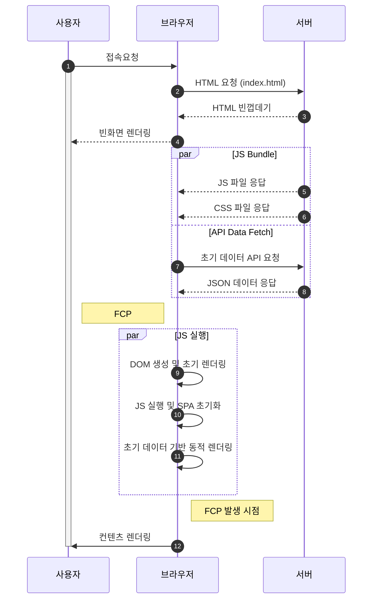
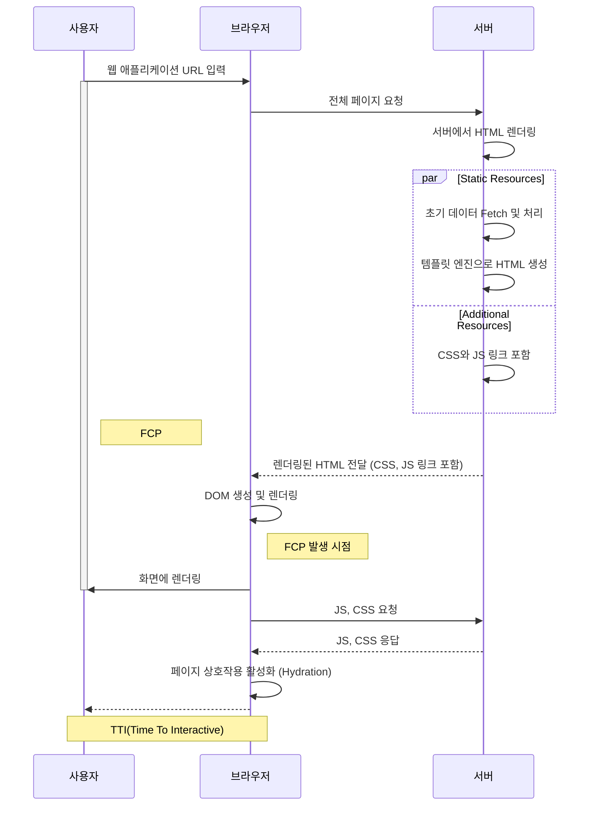

# NextJs의 꽃 SPR(Static Page Regeneration)
- SPR(Static Page Regeneration)은 Next.js의 **Incremental Static Regeneration(ISR)**기능을 통해 기존에 빌드된 정적 페이지를 일정 주기마다 갱신하는 방식
- CSR(Client Side Rendering)의 단점을 효율적으로 해결하는 기술

> 그렇다면 CSR은 무엇이고 어떤 단점이 있길래 이 단점을 해결하는 기술이라는 건가?
{: .prompt-warning }

## 1️⃣ CSR

① **사용자**가 브라우저에 접속요청을 하면 브라우저는 서버에게 index.html 을 요청한다

② **서버**는 브라우저-사용자에게 먼저 빈 HTML 화면을 우선 렌더링하여 보여준다.

③ **서버**측에서 JS Bundle 을 실행하여 API 요청한다.

④ **브라우저**는 응답받은 데이터와 함께 JS 실행하여 ( Dom 생성 및 데이터 기반 동적 렌더링하여 ) 사용자에게 렌더링된 컨텐츠를 보여준다.

### 🤷‍♀️CSR의 단점
① 초기 로딩 속도 느림 
- HTML이 빈 상태에서 전달되고, JS가 로드된 후 데이터 요청이 이루어지므로 첫 화면이 표시되기까지 시간이 걸림.

② SEO 문제 
- 검색 엔진 크롤러는 HTML을 읽지만, CSR 방식은 초기 HTML이 비어있어 **검색 엔진이 제대로 크롤링하지 못할 가능성이 있음.**

③ 초기 데이터 요청 중 깜빡임 발생 
- API 요청이 끝날 때까지 빈 화면 또는 로딩 화면이 보이는 문제가 발생할 수 있음.

## 2️⃣SPR(Static Page Regeneration)

① **사용자**가 브라우저에 접속요청을 하면 브라우저는 서버에게 index.html 을 요청한다.

② **서버**에서 HTML을 렌더링한다.
- **서버**에서 [Static Resources]를 실행하여 초기 데이터를 패칭하고 처리하여 **브라우저**에 보낸다.

③ **브라우저**는 DOM을 생성하여 **사용자**화면에 렌더링한다.
- 하시만 이 시점에서 사용자가 페이지 상호작용 불가

④ Hydration(수화작용: 페이지 상호작용 활성화)

### 💎 SPR의 장점
① 초기 로딩 속도 향상
- **정적으로 생성된 페이지를 먼저 제공**하므로 CSR보다 **초기 로딩 속도가 훨씬 빠름.**

② SEO 개선
- 기존 정적 페이지가 존재하므로, 크롤러가 **실제 콘텐츠를 크롤링**할 수 있음.

③ 깜빡임 현상 없음
- 클라이언트에서 데이터를 가져오는 것이 아니고, 서버에서 미리 만들어진 HTML을 제공하므로 UX가 개선됨.

